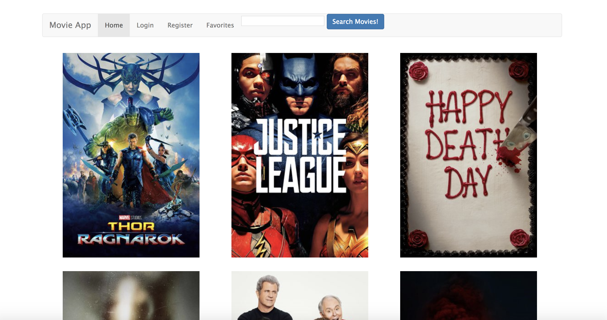
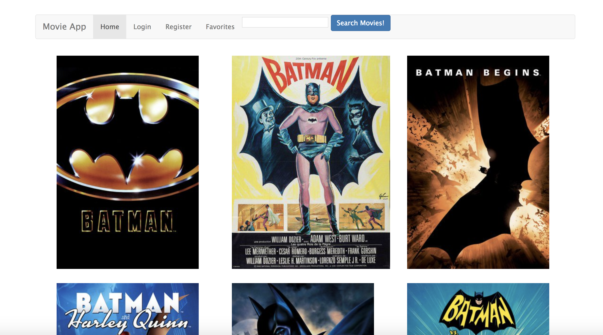

## Movie App
This movie app allows users to view movie posters and synopsis of movies now playing or searched movies via "The Movie Database" api. Also, it integrates with a MySQL database for login abilities.

## Github Link:
[Movie App GitHub](https://github.com/eddieatkinson/movie-app)

## Technologies used:
**Languages:**
* Node
* JavaScript
* HTML5
* CSS

**Frameworks:**
* Express
* jQuery
* Bootstrap

**Other:**
* AJAX
* MySQL

## Code snippets:
Movie search using "The Movie Database" api.
``` javascript
router.post('/search', (req, res)=>{
    var userSearch = req.body.movieIdSearch;
    request.get(anyMovie + userSearch, (error, response, movieData)=>{
        var parsedData = JSON.parse(movieData);
        res.render('index', {
            parsedData: parsedData.results,
            imageBaseUrl: imageBaseUrl,
            message: ''
        });
    }); 
});
```
Register:
``` javascript
router.post('/registerProcess', (req, res, next)=>{
    var name = req.body.name;
    var email = req.body.email;
    var password = req.body.password;
    // convert the English password to a bcrypt hash
    var hash = bcrypt.hashSync(password);

    const selectQuery = "SELECT * FROM users WHERE email = ?;";
    connection.query(selectQuery, [email], (error, results)=>{
        if(results.length == 0){ // user is not in DB
            var insertQuery = "INSERT INTO users (name, email, password) VALUES (?, ?, ?);";
            connection.query(insertQuery, [name, email, hash], (error, results)=>{
                if(error){
                    throw error;
                }else{
                    res.redirect('/?msg=registered');
                }
            });
        }else{ // user exists in DB
            res.redirect('/?msg=already in DB');
        }
    });
});
```
Login:
``` javascript
router.post('/loginProcess', (req, res, next)=>{
    var email = req.body.email;
    var password = req.body.password;
    // Check to see if the user is in the database:
    var selectQuery = "SELECT * FROM users WHERE email = ?";
    connection.query(selectQuery, [email], (error, results)=>{
        if(results.length == 0){ // user not in DB
            res.redirect('/login?msg=Not In System');
        }else{ // email in DB, check if password matches
            var doTheyMatch = bcrypt.compareSync(password, results[0].password);
            if(doTheyMatch){
                res.redirect('/?msg=Logged In');
            }else{
                res.redirect('/?msg=Passwords Do Not Match');
            }
        }
    });
});
```

## Screenshots:



